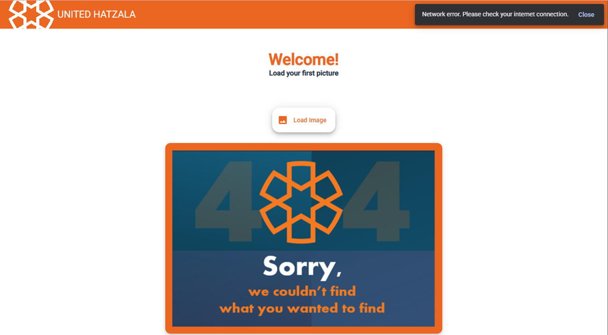

# AngularImageLoader

## 🚀 Overview
This project was generated using [Angular CLI](https://github.com/angular/angular-cli) version 19.1.7.


The project includes a single, visually pleasing designed screen consisting of several parts:
- Title (`ToolBar`)
- Button to load URL from the server
- Loading icon
- Image on a `Card` component.

The components are synchronized with each other and at any given time only some of them are on the screen, according to the business logic.

Design elements:
- I added a component to display error messages, if any.
- In addition, I added a `favicon` and a logo.
- Error messages are detailed according to status.


## ⬇️ Development server
To start a local development server, run:
```bash
npm install
ng serve
```
Once the server is running, open your browser and navigate to `http://localhost:4200/`. The application will automatically reload whenever you modify any of the source files.

## 📂 Folder Structure
In the `app` directory, you will find the following:
- `components` directory containing:
    - `main-page` component for the main page content.
    - `menu-bar` component for the title bar.
    - `image-loader` component for uploading the image URL from the server and display the image on the screen.
- `services` directory containing a single imageService file to make calls to the server.
- `environments` directory containing a single environment file which contains environment settings.

## 📚 Learning Resources
For more information on using the Angular CLI, including detailed command references, visit the [Angular CLI Overview and Command Reference](https://angular.dev/tools/cli) page.

## Author
Nomi Magnus